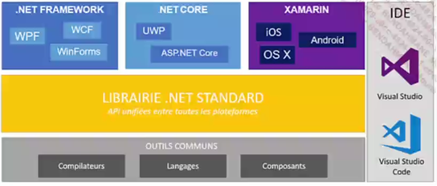
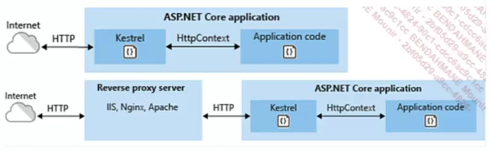
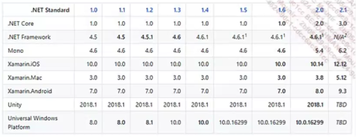
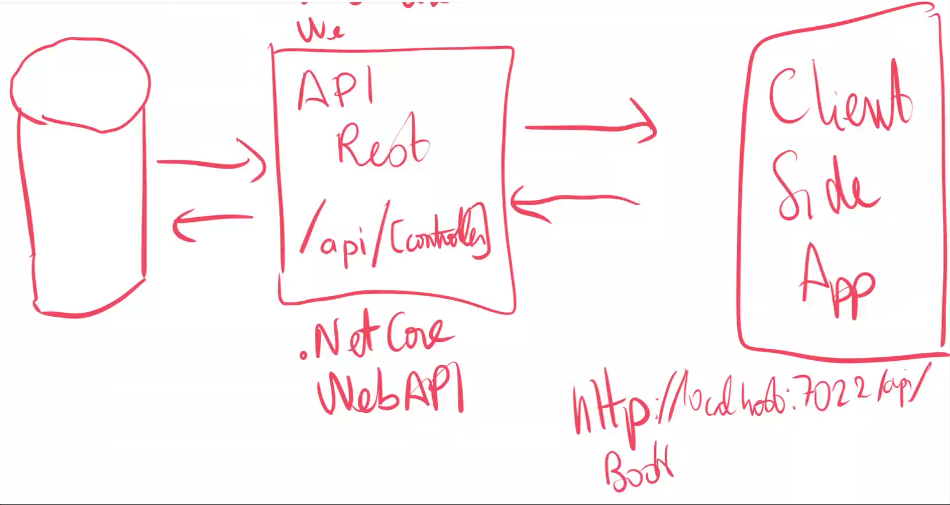

# .NET

.NET est un framework de dévelopement cross-platform et open source conçu par Microsoft. 

Voici un aperçu de technologie .NET :



La différence entre .NET et .NET Core est que .NET Core est open source et cross-platform, tandis que .NET Framework est propriétaire et ne fonctionne plus sur Windows.

La portabilité est un des avantages du .NET Core car il ne dépend pas de Windows mais de CoreCLR. Une version de CLR (Common Language Runtime) qui est cross-platform.

Les librairies NuGet : .NET Core utilise les librairies NuGet qui sont des librairies open source, tandis que .NET Framework utilise des librairies proprietaires de Microsoft.
Cependant, toutes les libraires de .NET Framework ne sont pas encore portées par .NET Core.


## .NET Core

L'une  des premières technologies introduites par .NET Core est ASP.NET Core, qui est un framework de développement web open source et cross-platform qui permet de : 
- d'unifier les API UI et Web API
- d'intégrer des frameworks côté client comme Angular, React, etc.
- de s'intégrer facilement dans un environnement Cloud
- d'héberger des applications avec Docker, Apache, Nginx, etc.

## Le pattern MVC

.NET utilise le pattern MVC (Model-View-Controller) pour développer des applications web: 

- séparation des couches logiques, métier et vue/présentation
- Razor Pages permet de créer des pages statiques HTML, web en général
- du Model Blinding et de la validation de Model


Architecture projet : 

Pour un projet .NET console on a juste à faire la commande suivante : 
```bash
dotnet new console
```

Le contenu du code source ne continent qu'une seule ligne dans le fichier Program.cs : 

```c#
        Console.WriteLine("Hello World!");
```

Pour avoir l'ancienne syntaxe avec plus de contenu on écrit :
```bash
dotnet new console --use-program-main
```

Pour lancer le programme : 
```bash
dotnet run
```

Pour créer projet MVC : 
```bash
dotnet new mvc
```

Le serveur web fourni avec ASP .NET Core est Kestrel c'est un serveur web cross-platform.



Kestrel va traiter toutes les requêtes et va donner les réponses au travers d'un objet de type 'HttpContext'.


## La convergence des frameworks .NET avec la version 5.0




## Les composants de .NET Core

1. Les librairies CoreFX 

C'est un ensemble de librairies qui integrent les classes basiques de .NET Core et elles sont dispo sous l'espace de nom `System.*`. (namespace)

La majorité des API de Core FX sont aussi dispos sur .NET Framework classique.
Core FX est une sorte de **fork** de Framework Class Library.

## Le langage C#

C# est un langage de programmation orienté objet très proche de Java. 

### Version 7.0

Qu'est ce qu'un tuple ? 
```c#
// Tuple de 2 elements en C# 7.0 anonyme
var letters = ("a", "b");
letters.Item1; //a
letters.Item2; //b

// Tuple nommé
(String Un , String Deux) = letters;
var alphabet = (Un:"a", Deux:"b");
alphabet.Un; //a
alphabet.Deux; //b
```

```c#
private static (int Max, int Min) Range(IEnumerable<int> numbers)
{
        int min = numbers[0];
        int max = numbers[0];
        foreach (var n in numbers[1..])
        {
                min = n < min ? n : min;
                max = n > max ? n : max;
        }
        return (max, min);
}
```

## Pattern Matching

```c#
public static int Sum(IEnumerable<object> values)
{
        var sum = 0;
        foreach (var value in values)
        {
                switch (item)
                {
                        case 0;
                        break;
                        case int val;
                        sum += val;
                        break;
                        case IEnumerable<object> subList when subList.Any();
                        sum += Sum(subList);
                }
        }
}
```


### Version 7.1

```c#
int count = 5;
string label = "Colors in the map";

var pair = (count, label); // (5, "Colors in the map")
pair.count; //5
```

On peut use le mot `async` dans les noms de méthodes main, par exemple : 

```c#
public static async Task Main()
{
        await DoSomethingAsync();
}
```

### Version 7.2

Nouveautés :

- le mot clé `in` pour les paramètres de méthode: la variable est passé par référence, mais ne peut pas être modifiée
- le mot clé `ref readonly` pour les paramètres de méthode: la variable est spéc par défaut, et ne peut pas être modifiée
- le mot clé `readonly struct` : la struct est immutable et ne peut être tranferée qu'avec le mot clé `in` 

### Version 8.0

```c#
String? s = null;
Console.WriteLine(s);
```

En C#, on peut fournir une implementation par défaut pour les interfaces 

En C#, il est possible de déclarer une séquence de valeurs facilement par exemple : 

```c#
// Range
var maRange = array[4..^2];
//Output 

```


## Les fonctionnalités .NET Core

### Le cli 

les commandes utiles : 
- **dotnet new** : pour créer un nouveau projet (cf. [dotnet new](BiblioPerso.md))
- **dotnet restore** : pour déployer les librairies du projet
- **dotnet build** : pour construire le projet
- **dotnet run** : pour lancer le projet
- **dotnet test** : pour lancer les tests unitaires
- **dotnet publish** : pour publier le projet
- **dotnet pack** : pour construire un paquet .NET Core
- **dotnet nuget** : pour utiliser le gestionnaire de paquets NuGet

### La structure d'une solution .NET

Une solution .NET est un ensemble de projets. On la réprésente par un fichier avec l'extension `.sln`.

### MVC :
#### Properties :

Intègre les propriétés du projet mais pas toutes dans le launchSettings.json

#### wwwroot :

Contient tous les fichiers statiques du projet qui sont vus dans le navigateur, côté client.

#### Controllers Models Views :

Contient tous les fichiers du code source du projet.
Ils sont utilisés pour construire la structure du site web. 

#### Appsettings.json :

Il contient les paramètres de configuration du projet, un peu comme les variables d'environnement du projet. 

#### Program.cs :

Contient le code principal du projet. Il est le point d'entrée du programme. 

### La configuration de l'application :

Les fichiers de config sont des fichiers JSON qui sont stockés dans le dossier `appsettings.json`.


### API : 

Explication API : cf. [BiblioPerso](BiblioPerso.md)

### NuGet Package Manager :
Se rendre sur [NuGet](https://www.nuget.org) pour voir l'entièreté des commandes pour les packages NuGet.

Ici on utilise : 
```bash
dotnet add package Microsoft.EntityFrameworkCore --version 8.0.0
```


### Configuration de SQLite

- Ajout des packets suivants : 

```bash
dotnet add package Microsoft.EntityFrameworkCore.Design --version 8.0.0
```
Et 
```bash
dotnet add package Microsoft.EntityFrameworkCore.Sqlite --version 8.0.0
```

- Installation des outils en ligne de commande :

```bash
dotnet tool install --global dotnet-ef
```

- Creer une classe qui hérite du `DbContext` :

```c#
public class MyDbContext : DbContext
{
    public MyDbContext(DbContextOptions<MyDbContext> options) : base(options)
    {
    }
}
```
- Ajout de la propriété de type DbSet<T> pour chauqe entité

```c#
public DbSet<MyEntity> MyEntities { get; set; }
```

- Ajouter une méthode de OnConfiguring pour la connexion à la base de données :

```c#
protected override void OnConfiguring(DbContextOptionsBuilder optionsBuilder)
{
    optionsBuilder.UseSqlite("Data Source=MyDatabase.db");
}
```

- Trouver le moyen de spécifier le bon chemin pour le fichier de la base de données :

- Utiliser la commande pour la première migration :

```bash
dotnet ef migrations add InitialCreate
```

- Lancer la migration :

```bash
dotnet ef database update
```


Validation model avec ModelState et utilisation de DTOs avec annotations
créer classe model dto 


AutoMapper = automatiquement réaliser les mappages entre les objets et les DTOs 
repository pattern  