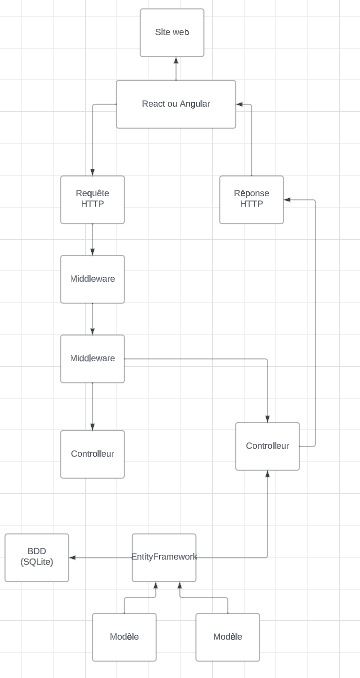

1: Expliquez la différence entre ASP.NET Core et ASP.NET Framework.
(2 points)

ASP.NET Core est une version plus récente de ASP.NET.
Il est cross platform. ASP.NET Framework est lui propriétaire et donc seulement disponible sur Windows.
ASP.NET Core est aussi plus léger quand on développe car il dépend de CoreCLR (c'est Common Language Runtime)

2 : Quels sont les principaux composants d'une API ASP.NET Core et comment ils interagissent entre eux ? (un schéma est attendu)
(3 points)




Contrôleurs : Les contrôleurs sont des classes qui gèrent les requêtes HTTP entrantes et retournent les bonnes réponses.

Routes : Les routes définissent les URL auxquelles les requêtes HTTP peuvent être envoyées.

Modèles de données : Les modèles de données sont des classes qui représentent les objets manipulés par l'API. Ils peuvent être utilisés pour valider les données entrantes pendant la lecture ou l'écriture de ces donnees.

Services : Les services sont des classes qui fournissent des fonctionnalités spécifiques à l'API. Ils peuvent être utilisés pour effectuer des opérations de base de données, gérer l'authentification, autorisation, etc.

Middleware : Le middleware est une série de composants qui s'exécutent dans le pipeline de traitement des requêtes HTTP. Chaque composant effectue une tâche spécifique : l'authentification, la compression, etc.

Gestionnaires d'erreurs : Les gestionnaires d'erreurs sont des composants qui gèrent les erreurs survenues lors du traitement des requêtes

Quand une requête Http est recue, le middleware triate la requete et fait les opérations (authentification par exemple).
Ensuite, en fonction de la route, la requete est dirigé vers le bon controlleur.
Le controlleur utilise les services qui y sont injectés pour faire des operations comme accès la base de donnees.
Ensuite le controlleur utilise les modeles de donnees pour valider les données qui entrent puis il envoi une reponse http au client.
Si il y a une erreur, les gestionnaires d'erreur sont utilisés pour renvoyer les reponses aux clients.


3: Comment configurer le routage dans une application ASP.NET Core ? Donnez un exemple à partir du code fourni.

Pour configurer le routage, d'après le code fourni, on peut suivre ces étapes : 
On ouvre notre fichier Program.cs et on ajoute la méthode UseEndpoints de l'objet app comme ceci: 
```cs
app.UseEndpoints(endpoints =>
{
    endpoints.MapControllers();
});

app.Run();
```
Ici on indique à notre application que son routage est basé sur les controllers. Toutes nos requetes Http vont être envoyées vers le controller qui correspond en fonction des url demandés.
Ensuite, on ajoute la route correspondante avec son url dans chacun de nos controller.
Ici, on a par exemple :
```cs
    [Route("api/v{version:apiVersion}/cities")]
et  [Route("api/authentication")]
et  [Route("api/files")]
et  [Route("api/v{version:apiVersion}/cities/{cityId}/pointsofinterest")]

```


4: Expliquez le rôle des attributs [HttpGet], [HttpPost], etc., dans la définition des actions du contrôleur.

Ces attributs sont utilisés pour spécifier le type de requête HTTP que l'action doit traiter. Chaque attribut correspond à une méthode HTTP spécifique. Par exemple, l'attribut [HttpGet] indique que l'action qui doit être appelée quand on fait requête HTTP GET est effectuée vers l'URL correspondante. Pareil pour Put, Post ou Delete. 


5: Comment pouvez-vous valider les données d'entrée dans une API ASP.NET Core ? Donnez des exemples de techniques de validation.

Pour valider les données d'entrées, je vais parler de deux techniques utilisées au cours de cette semaine :
- La validation par annotations de modèles. On peut utiliser les attributs de validation que .NET nous donne comme [Required] ou [StringLength] pour indiquer les règles de validations directement dans les modèles de nos données. 
Dans le code fourni on peut par exemple trouver : 
```cs
[Required(ErrorMessage = "You should provide a name value.")] // oblige à remplir le champ sous peine de message d'erreur
[MaxLength(50)] // spécifie que la taille maximale du champ est de 50 carcatères
public string Name { get; set; } = string.Empty;
```

- La validation par erreur de modèle. On peut vérifier si le modèle est valide dans notre controller en utilisant la propriété qui s'appelle ``ModelState.IsValid``. Si on a notre modèle qui n'est pas valide, on peut renvoyer une erreur.
Dans le code fourni on peut par exemple trouver : 
```cs
if (!ModelState.IsValid) // on vérifie si le modele n'est pas valide
{
    return BadRequest(ModelState); // s'il ne l'est pas on retourne une BadRequest
}
```


6 : D'après vos connaissances actuelles, expliquez le fonctionnement de l'application fournie, quel outil permet d'avoir un aperçu des fonctionnalités d'une API .NET. ?


L'outil qui permet d'avoir un aperçu des fonctionnalités se nomme Swagger. C'est est une interface de documentation de API. Il fournit des interfaces pour montrer les fonctionnalités d'une API, les endpoints, les paramètres, les réponses et les erreurs.

L'appliacation fournie semble nous montrer un répertoire de villes ainsi que leurs point d'intêret, les lieux touristiques. 
L'application est constituée de quatre controllers : 
- Un pour une authentification
- Un pour les fichier 
- Un pour les villes 
- Un pour les Point d'interet/ lieux touristiques

On retrouve ensuite des Entités (Modèles) : 
- Pour les villes 
- Pour les points d'interets

Elle est également implémentée de plusieurs modèles DTO (data tranfer object) :
- Modèle pour les villes
- Modèle pour les points d'interets
- Modèle pour les villes et leurs points d'interets

On peut également noter la présence d'une base de donnée locale où sont donc stockés les villes, leurs points d'interets et les fichiers. Pour cela on a sûrement dû effectué une migration dans le cadre de l'initialisation de SQLite. 

L'application sert donc, apres s'être authentifié à récupérer des villes pour savoir quels sont les lieux intéressants que l'on pourrait visiter dans celle-ci. 


7 :L'application ne build pas, pourquoi ? Expliquez comment corriger l'erreur de compilation.

Ici, l'application ne build pas car dans le controller (CitiesController) la méthode get a déjà un nom de fonction initialisé à 'GetCity' dans la première méthode Get. Pour corriger cela, il suffit simplement de changer le nom dans la deuxième ou la première méthode Get. 
On peut par exemple mettre : 
```cs
public async Task<IActionResult> GetCityEXAMEN(
            int id, bool includePointsOfInterest = false)
```
Dans ce cas, l'application build correctement 


8: Tentez faire fonctionner un poitn d'entree securisé, une erreur d'exécution se produit, pourquoi ? Comment la corriger ?

Une erreur se produit car dans l'annotation [HttpGet] du fichier CitiesController.cs, le chemin spécifié est deux fois le même pour de Get : On a [HttpGet("{id}")] deux fois. Donc au moment du build, cela fonctionne mais au moment du run, cela plante. 
Il faut donc modifier le chemin de l'un des deux : [HttpGet("{id2}")] et cela fonctionne. 